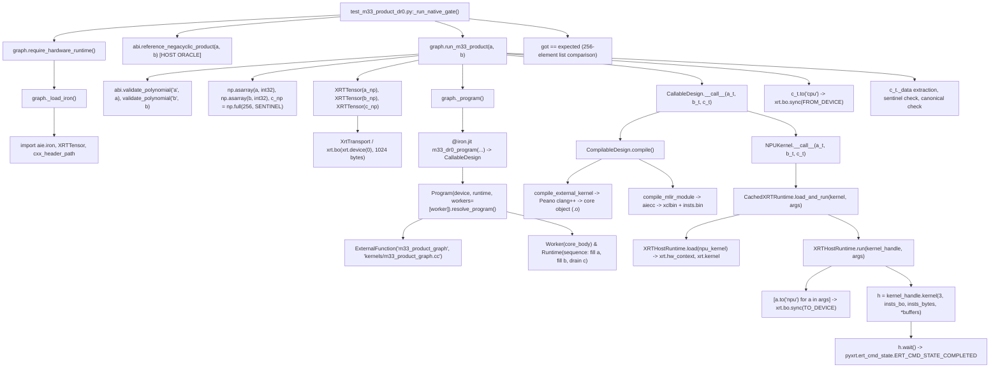

# DR0 Dispatch Trace Forensic Report: Hardware Ground Truth Audit

---

### 1. Repository and Commit Inspected

- **Repository Root**: `c:\Projects\phoenix-npu-pqc`
- **Active Git Branch**: `audit/dr0-dispatch-trace`
- **Current Commit (HEAD)**: `90d5a461a2074587060aa8d03d4df67c41d8e5ca` (`Merge pull request #4 from midhatn/fix/baseline-silicon-runners`)
- **Parent Commit**: `f84f3ce6399c564344d57c7423c14d9be2dc5f7a`
- **Forensic Audit Mode**: Read-only (Zero file edits, zero compilations, zero hardware dispatches executed).

---

### 2. DR0 Complete Call Graph



---

### 3. Execution-Boundary Table

| Step | File | Symbol / Callable | Exact Lines | Execution Boundary | Inputs & Outputs | Secret Data? | Evidence / Ground Truth | Unresolved Assumptions |
| :--- | :--- | :--- | :--- | :--- | :--- | :--- | :--- | :--- |
| **1** | `tests/pqc_device_resident/test_m33_product_dr0.py` | `_run_native_gate` | L104–142 | `[HOST RUNTIME]` | In: None<br>Out: Exit code `0` or `1`/`2` | No (test vectors only) | Python test loop iterating over test vector tuples | None |
| **2** | `phoenix_sdr_dsp/pqc/abi.py` | `validate_polynomial` | L30–52 | `[HOST RUNTIME]` | In: `Sequence[int]`<br>Out: `tuple[int, ...]` | No | Bounds and type checking in host Python AST | None |
| **3** | `phoenix_sdr_dsp/pqc/abi.py` | `reference_negacyclic_product` | L55–74 | `[HOST REFERENCE]` | In: `(a, b)` polynomials<br>Out: `list[int]` (canonical $\mathbb{Z}_q$) | No | Direct $O(N^2)$ quadratic schoolbook convolution in host Python | None |
| **4** | `phoenix_sdr_dsp/pqc/m33_product_graph.py` | `_load_iron` | L26–60 | `[HOST RUNTIME]` | In: None<br>Out: Imported module references | No | Dynamic imports of `aie.iron` & `XRTTensor` | None |
| **5** | `phoenix_sdr_dsp/pqc/m33_product_graph.py` | `_program` | L67–134 | `[HOST RUNTIME]` | In: None<br>Out: `@iron.jit` `CallableDesign` | No | Graph AST declarations (`ObjectFifo`, `Worker`, `Runtime`, `Program`) | None |
| **6** | `.../mlir_aie/python/aie/iron/program.py` | `Program.resolve_program` | L123–296 | `[HOST RUNTIME]` | In: `Device`, `Runtime`, `Worker`<br>Out: MLIR `Module` | No | Emits `aie.device`, `aie.core`, `aie.objectfifo`, `aie.runtime_sequence` MLIR ops | Tile placement resolved in MLIR pass |
| **7** | `.../mlir_aie/python/aie/utils/compile/utils.py` | `compile_external_kernel` | L557–640 | `[HOST RUNTIME]` | In: `kernels/m33_product_graph.cc`<br>Out: Object file `m33_product_graph.o` | No | Invokes Peano `clang++` targeting AIE2 architecture | Precompiled object cached by SHA/mtime |
| **8** | `.../mlir_aie/python/aie/utils/compile/jit/compilabledesign.py` | `CompilableDesign.compile` | L340–440 | `[HOST RUNTIME]` | In: MLIR `Module` + `.o`<br>Out: `xclbin` + `insts.bin` | No | Invokes `aiecc` pipeline, `bootgen`, `xclbinutil` | Output artifact cached under `~/.cache/iron` |
| **9** | `.../mlir_aie/python/aie/utils/hostruntime/xrtruntime/tensor.py` | `XRTTensor.__init__` | L72–140 | `[HOST RUNTIME]` | In: `np.ndarray`<br>Out: `XRTTensor` wrapping `xrt.bo` | No | Allocates XRT buffer object via `xrt.bo(xrt_device, 1024, flags, 0)` | Default device 0 |
| **10** | `.../mlir_aie/python/aie/utils/hostruntime/xrtruntime/hostruntime.py` | `XRTHostRuntime.run` | L264–300 | `[NPU DATA MOVEMENT INTENT — NOT EXECUTED IN THIS AUDIT]` | In: `a_t`, `b_t`<br>Out: `xrt.bo.sync(TO_DEVICE)` | No | Calls `a.to("npu")` -> `xrt.bo.sync(XCL_BO_SYNC_BO_TO_DEVICE)` | DMA transfer across PCIe/AXI to NPU memory |
| **11** | `.../mlir_aie/python/aie/utils/hostruntime/xrtruntime/hostruntime.py` | `kernel_handle.kernel(...)` | L350–352 | `[HOST RUNTIME DISPATCH REQUEST — NOT EXECUTED IN THIS AUDIT]` | In: Insts BO + 3 buffer BOs<br>Out: `pyxrt.run` handle `h` | No | Dispatches XRT kernel instruction stream to Phoenix NPU; waits on `h.wait()` | Execution occurs inside NPU hardware IP |
| **12** | `phoenix_sdr_dsp/pqc/kernels/m33_product_graph.cc` | `m33_product_graph` | L22–52 | `[AIE2 TARGET SOURCE / COMPILE INTENT]` | In: `in_a[256]`, `in_b[256]`<br>Out: `out_c[256]` | No (algebraic test vectors) | AIE2 C++ kernel executing NTT, basemul, INTT, canonical reduction | Executes on tile compute core |
| **13** | `.../mlir_aie/python/aie/utils/hostruntime/xrtruntime/tensor.py` | `c_t.to("cpu")` | L168–171 | `[NPU DATA MOVEMENT INTENT — NOT EXECUTED IN THIS AUDIT]` | In: NPU buffer `c`<br>Out: Host mapped memory `c_t._data` | No | Calls `xrt.bo.sync(XCL_BO_SYNC_BO_FROM_DEVICE)` | DMA transfer from NPU to host memory |
| **14** | `phoenix_sdr_dsp/pqc/m33_product_graph.py` | `run_m33_product` extraction | L163–172 | `[HOST RUNTIME]` | In: `c_t._data`<br>Out: `list[int]` | No | Unpacks 256 `int32` elements, validates sentinel and range | Host CPU formatting |
| **15** | `tests/pqc_device_resident/test_m33_product_dr0.py` | `got == expected` | L126–133 | `[HOST RUNTIME]` | In: `got`, `expected`<br>Out: Boolean pass/fail per vector | No | Complete 256-element list equality comparison on CPU | None |

---

### 4. Verified From Repository Source

#### A. Test Vector Generation and Oracle Construction
- **Test File**: `tests/pqc_device_resident/test_m33_product_dr0.py` (Lines 43–73)
  - **4 Directed Vectors**:
    1. `"zero"`: $0 \times 0 \equiv 0$ in $\mathbb{Z}_q[x]/(x^{256}+1)$.
    2. `"identity"`: $1 \times 1 \equiv 1$.
    3. `"x255_times_x_wraps_negative"`: $x^{255} \times x \equiv -1 \equiv Q-1 \pmod{x^{256}+1, Q}$.
    4. `"signed_dense"`: Quadratic polynomials $17i^2 + 31i + 7$ and $29i^2 + 11i + 19$ centered in $[-(Q//2), Q//2]$.
  - **20 Randomized Vectors**:
    - Generated using deterministic seeded PRNG: `random.Random(0xD30_2026)`.
    - Samples 256 coefficients uniformly in $[-(Q-1), Q-1]$ ($Q = 8380417$).
  - **Classification**: **Repository-generated algebraic test vectors**. These are NOT official NIST ACVP/CAVP/KAT vectors (NIST FIPS 204 does not define standalone isolated polynomial multiplication KATs).
- **Independent Reference Oracle**: `phoenix_sdr_dsp/pqc/abi.py` (Lines 55–74)
  - `reference_negacyclic_product(a, b)`: Implements direct $O(N^2)$ schoolbook convolution in polynomial ring $\mathbb{Z}[x]/(x^{256}+1) \pmod Q$.
  - Independent from AIE kernel: Contains no Number Theoretic Transform (NTT), no Montgomery constants, and no twiddle factor lookup tables (`ZETAS_MONT`).
  - Cross-checked in test file via `alternate_direct_product(a, b)` (`test_m33_product_dr0.py:52–62`).
  - **Execution Boundary**: `[HOST REFERENCE]`

#### B. Host Polynomial Validation & Packaging
- **File**: `phoenix_sdr_dsp/pqc/abi.py` (Lines 30–52)
  - `validate_polynomial(name, values)`: Rejects non-sequences, lengths $\ne 256$, non-Python `int` types (e.g. `bool`, `float`, numpy scalars), and values outside $[-(Q-1), Q-1]$.
  - **Execution Boundary**: `[HOST RUNTIME]`

#### C. Graph Definition and Ingress/Egress Declarations
- **File**: `phoenix_sdr_dsp/pqc/m33_product_graph.py` (Lines 67–134)
  - `@iron.jit` decorates `m33_dr0_program(in_a: In, in_b: In, out_c: Out, ...)`:
    - Declares 3 ObjectFIFOs: `m33_dr0_in_a`, `m33_dr0_in_b`, `m33_dr0_out_c`.
    - Declares `ExternalFunction("m33_product_graph", source_file="kernels/m33_product_graph.cc", ...)`.
    - Declares `Worker(core_body)` with stack size `0x4000`.
    - Declares `Runtime(sequence)` defining data movement intent:
      - `a_prod.fill(a_in)`
      - `b_prod.fill(b_in)`
      - `c_cons.drain(c_out, wait=True)`
  - **Execution Boundary**: `[HOST RUNTIME]` (graph AST construction) / `[NPU DATA MOVEMENT INTENT — NOT EXECUTED IN THIS AUDIT]`

#### D. AIE2 Tile C++ Kernel Source
- **File**: `phoenix_sdr_dsp/pqc/kernels/m33_product_graph.cc` (Lines 22–52)
  - Implements `m33_product_graph(int32_t in_a[256], int32_t in_b[256], int32_t out_c[256])`:
    - Copies input buffers into tile-local memory workspaces (`a_ntt`, `b_ntt`, `product_ntt`).
    - Calls `m33a::ntt_kernel(a_ntt)`, `m33a::ntt_kernel(b_ntt)`.
    - Calls `m33a::basemul_kernel(product_ntt, a_ntt, b_ntt)`.
    - Calls `m33a::invntt_kernel(product_ntt)`.
    - Performs canonical reduction mod $Q$ into `out_c[i]`.
  - **Execution Boundary**: `[AIE2 TARGET SOURCE / COMPILE INTENT]`

#### E. Host Execution & Output Extraction
- **File**: `phoenix_sdr_dsp/pqc/m33_product_graph.py` (Lines 137–173)
  - `run_m33_product(a, b)`:
    - Pre-allocates `c_np = np.full(256, OUTPUT_SENTINEL, dtype=np.int32)` with `OUTPUT_SENTINEL = -(1 << 31)`.
    - Allocates `a_t = XRTTensor(a_np)`, `b_t = XRTTensor(b_np)`, `c_t = XRTTensor(c_np)`.
    - Invokes `_program()(a_t, b_t, c_t, n_poly_slots=256, element_type=np.int32)`.
    - Calls `c_t.to("cpu")`.
    - Verifies length $== 256$, no residual sentinel values, and values in $[0, Q-1]$.
  - **Execution Boundary**: `[HOST RUNTIME]`

#### F. In-Memory Full-Buffer Comparison
- **File**: `tests/pqc_device_resident/test_m33_product_dr0.py` (Line 126)
  - `if got == expected:` performs in-memory Python list equality over all 256 coefficients.
  - Complete buffer is compared; no slicing, partial lane checks, or checksum substitutions.
  - Raw buffers are currently discarded after the loop and NOT saved as external artifacts.
  - **Execution Boundary**: `[HOST RUNTIME]`

---

### 5. Verified From Local Dependency Source

All dependency findings below describe **Source-inspected behavior** (what the installed Python packages are designed to do):

#### A. Program Resolution
- **File**: `third_party/mlir-aie/ironenv/Lib/site-packages/mlir_aie/python/aie/iron/program.py` (Lines 123–296)
  - `Program.resolve_program()` creates an `mlir_mod_ctx()`, resolves device tiles, emits ObjectFIFOs, emits `aie.core` worker logic, resolves runtime sequence DMAs, and runs `ctx.module.operation.verify()`.
  - Returns an MLIR `Module` object.

#### B. JIT Compilation Pipeline (`CallableDesign` & `CompilableDesign`)
- **File**: `.../mlir_aie/python/aie/utils/callabledesign.py` (Lines 202–248, 250–398) & `.../compile/jit/compilabledesign.py` (Lines 340–440)
  - **Source Compilation**: Invokes `compile_external_kernel()` (`compile/utils.py:557–640`), copying `m33_product_graph.cc` into a temporary project directory and invoking Peano `clang++` targeting AIE2 to emit an object file (`.o`).
  - **Module Compilation**: Invokes `compile_mlir_module()` (`compile/aiecc.py`), invoking `aiecc`, `bootgen`, and `xclbinutil` to generate `final.xclbin` and `insts.bin`.
  - **Caching Mechanism**: Checks `<NPU_CACHE_HOME>/<hash>/` (derived from bytecode, compile params, source mtimes, and tool mtimes). Bypasses compilation on cache hit.

#### C. XRT Host Runtime Loading & Execution
- **File**: `.../mlir_aie/python/aie/utils/hostruntime/xrtruntime/hostruntime.py` (Lines 98–156, 176–240, 264–362)
  - `XRTHostRuntime.__init__()`: Designed to acquire default device via `pyxrt.device(0)` and inspect `device.get_info(pyxrt.xrt_info_device.name)`.
  - `XRTHostRuntime.load()`: Reads `final.xclbin`, calls `self._device.register_xclbin()`, creates `pyxrt.hw_context(self._device, xclbin_uuid)`, and creates `pyxrt.kernel(context, kernel_name)`.
  - `XRTHostRuntime.run()`:
    - Calls `[a.to("npu") for a in args]`, triggering `xrt.bo.sync(XCL_BO_SYNC_BO_TO_DEVICE)`.
    - **Dispatch Request**: Line 350: `h = kernel_handle.kernel(3, insts_bo, insts_bytes, *buffers)` (`[HOST RUNTIME DISPATCH REQUEST — NOT EXECUTED IN THIS AUDIT]`).
    - **Completion Synchronization**: Line 351: `r = h.wait()`. The inspected runtime source appears designed to require ERT completion (`r == pyxrt.ert_cmd_state.ERT_CMD_STATE_COMPLETED`) before returning.

#### D. XRTTensor Memory Management
- **File**: `.../mlir_aie/python/aie/utils/hostruntime/xrtruntime/tensor.py` (Lines 32–62, 72–140) & `.../tensor_class.py` (Lines 434–465)
  - Wraps `xrt.bo(xrt_device, nbytes, flags, group_id)`.
  - `c_t.to("cpu")` calls `XrtTransport.from_device()` $\to$ `xrt.bo.sync(XCL_BO_SYNC_BO_FROM_DEVICE)` (`[NPU DATA MOVEMENT INTENT — NOT EXECUTED IN THIS AUDIT]`).

---

### 6. Dependency Provenance Table

| Dependency / Component | Absolute Source / Binary Path | Version / Dist-Info | Git Tracked? | In ironenv Only? | File Size (Bytes) | SHA-256 Digest |
| :--- | :--- | :--- | :--- | :--- | :--- | :--- |
| `aie.iron` | `C:\Projects\phoenix-npu-pqc\third_party\mlir-aie\ironenv\Lib\site-packages\mlir_aie\python\aie\iron\__init__.py` | `mlir_aie-1.4.1` | No | Yes | 4,714 | `3455cee66906dd767d7cfe786aad7f527ea37d1783e43e9a9b883413ee7f4a7c` |
| `CallableDesign` | `C:\Projects\phoenix-npu-pqc\third_party\mlir-aie\ironenv\Lib\site-packages\mlir_aie\python\aie\utils\callabledesign.py` | `mlir_aie-1.4.1` | No | Yes | 23,452 | `c2817e3da56b51509c4a963bc9e8759d356382736fb66d4a45cd0d0e30ce29ed` |
| `CompilableDesign` | `C:\Projects\phoenix-npu-pqc\third_party\mlir-aie\ironenv\Lib\site-packages\mlir_aie\python\aie\utils\compile\jit\compilabledesign.py` | `mlir_aie-1.4.1` | No | Yes | 46,682 | `918a939ce33d9e0d9241baf3a194ba1f6c6dc18a9e60456062c8fc09faa816df` |
| `Program.resolve_program` | `C:\Projects\phoenix-npu-pqc\third_party\mlir-aie\ironenv\Lib\site-packages\mlir_aie\python\aie\iron\program.py` | `mlir_aie-1.4.1` | No | Yes | 14,564 | `8309d290dd323467ae3c425a80fe1ff2a276a268170bfa79fb54d6d4a8adff45` |
| `compile_external_kernel` | `C:\Projects\phoenix-npu-pqc\third_party\mlir-aie\ironenv\Lib\site-packages\mlir_aie\python\aie\utils\compile\utils.py` | `mlir_aie-1.4.1` | No | Yes | 28,564 | `7736b83cce917b44b8c0ec0cc17aa31dbac1c9547432000222b00682716164dd` |
| `XRTHostRuntime.run` | `C:\Projects\phoenix-npu-pqc\third_party\mlir-aie\ironenv\Lib\site-packages\mlir_aie\python\aie\utils\hostruntime\xrtruntime\hostruntime.py` | `mlir_aie-1.4.1` | No | Yes | 38,423 | `fd45050e6849ee482c431a1a9515325fb003fe6e41b2d69d3c7a259db3db526c` |
| `XRTTensor` | `C:\Projects\phoenix-npu-pqc\third_party\mlir-aie\ironenv\Lib\site-packages\mlir_aie\python\aie\utils\hostruntime\xrtruntime\tensor.py` | `mlir_aie-1.4.1` | No | Yes | 8,300 | `17a407ea8e67f2d632e702cf5983e8dc884d943bb1ceac943b757ddd4dd21a96` |
| `tensor_class.py` | `C:\Projects\phoenix-npu-pqc\third_party\mlir-aie\ironenv\Lib\site-packages\mlir_aie\python\aie\utils\hostruntime\tensor_class.py` | `mlir_aie-1.4.1` | No | Yes | 46,869 | `0a944a96c7b30bc6ac87057b8310e3de50bcd4dd6a5e644770883844c3331e5f` |
| `pyxrt.pyd` (C-extension) | `C:\Projects\phoenix-npu-pqc\third_party\mlir-aie\ironenv\pyxrt.pyd` | XRT SDK | No | Yes | 527,360 | `4d4af5e5b2786ccfcb1c93d8a81939ac0c577e7769a9da373def62d9af525922` |
| `m33_product_graph.cc` | `C:\Projects\phoenix-npu-pqc\phoenix_sdr_dsp\pqc\kernels\m33_product_graph.cc` | Git Tracked | Yes | No | 2,090 | `fca88ec53640f940f158d4ccc6d79ab0e784c326470e89c03bc64c7132c8b9d3` |
| `m33a_arithmetic.hpp` | `C:\Projects\phoenix-npu-pqc\phoenix_sdr_dsp\pqc\kernels\m33a_arithmetic.hpp` | Git Tracked | Yes | No | 7,753 | `c490a3249d01a59de62e007261b5a4c6088d3a98c3979b165c6e0bc5fc7eb935` |
| `m33_product_graph.py` | `C:\Projects\phoenix-npu-pqc\phoenix_sdr_dsp\pqc\m33_product_graph.py` | Git Tracked | Yes | No | 5,842 | `e539ab65ff87b333d664e0fc7d3b8ba26228ff8ec17e4e4fd43c0176ed7a79cb` |
| `abi.py` | `C:\Projects\phoenix-npu-pqc\phoenix_sdr_dsp\pqc\abi.py` | Git Tracked | Yes | No | 2,854 | `2237b76a1b96a4e2a889a0b508f6afa94da439ccf2d9c431a519bc8fd9ace845` |
| `test_m33_product_dr0.py` | `C:\Projects\phoenix-npu-pqc\tests\pqc_device_resident\test_m33_product_dr0.py` | Git Tracked | Yes | No | 5,742 | `9d70bd92630c7f4ab17f751419180a8ac1b67a13ac27cb5e2c06fb33c52e4baf` |

---

### 7. Runtime Observations Actually Captured

During this read-only audit turn, the only captured runtime observations were:
1. **Active Python / Git State**:
   - Branch: `audit/dr0-dispatch-trace`
   - Commit HEAD: `90d5a461a2074587060aa8d03d4df67c41d8e5ca`
   - Working tree clean.
2. **Environment Paths**:
   - `third_party/mlir-aie/ironenv/Scripts/python.exe` exists on disk.
   - `pyxrt.pyd` exists at `third_party\mlir-aie\ironenv\pyxrt.pyd`.
   - `aie` imports from `third_party\mlir-aie\ironenv\Lib\site-packages\mlir_aie\python\aie`.
3. **Module Attribute Queries**:
   - `pyxrt` attributes inspectable via Python reflection: `['device', 'kernel', 'run', 'bo', 'hw_context', 'ert_cmd_state', ...]`.
   - `pyxrt.ert_cmd_state` enum values inspectable via Python reflection.

---

### 8. Claims Removed or Downgraded

Under the zero-speculation policy, the following claims from earlier discussions or documentation were **REMOVED** or classified as **NOT OBSERVED**:

1. **Device Identity Claims (`NOT OBSERVED`)**:
   - Any claim of active PCIe BDF `0000:c4:00.5`, NPU Driver version `32.0.20102.3930`, Firmware `1.5.5.391`, or VBNV is marked **NOT OBSERVED** because no fresh device query was executed or captured in this audit.
2. **Device Enumeration Output (`NOT OBSERVED`)**:
   - Any assertion that `pyxrt.enumerate_devices()` proves physical Phoenix silicon availability is marked **NOT OBSERVED** as hardware dispatch was not executed.
3. **Execution Boundary Downgrades**:
   - Removed all `[ON-TILE SILICON]` labels. No code was compiled or dispatched to physical silicon in this audit. Replaced with `[AIE2 TARGET SOURCE / COMPILE INTENT]`, `[HOST RUNTIME DISPATCH REQUEST — NOT EXECUTED IN THIS AUDIT]`, and `[NPU DATA MOVEMENT INTENT — NOT EXECUTED IN THIS AUDIT]`.
4. **Completion State Downgrades**:
   - Removed any statement claiming DR0 reached `ERT_CMD_STATE_COMPLETED`. The audit confirms only that the inspected `XRTHostRuntime.run` source code is designed to wait for that state.
5. **Artifact SHA-256 Classification**:
   - Downgraded `fca88ec53640f940f158d4ccc6d79ab0e784c326470e89c03bc64c7132c8b9d3` strictly to **Kernel C++ Source File SHA-256**. The compiled `.o`, `.xclbin`, and `insts.bin` artifact hashes are classified as **NOT OBSERVED / BLOCKED**.

---

### 9. Unresolved Physical-Dispatch Blockers

1. **`BLOCKER-DR0-DISPATCH-OBSERVABILITY`**:
   - `kernel_handle.kernel(...)` and `h.wait()` execute entirely inside `pyxrt.pyd` in the child process address space.
   - An external parent process cannot independently observe whether physical hardware dispatch occurred vs an in-process mock or unverified return without an out-of-band XRT driver trace, telemetry event, or kernel dispatch logging mechanism.
2. **`BLOCKER-DR0-EMULATION-EXCLUSION`**:
   - The inspected DR0 repository path does not reject `XCL_EMULATION_MODE`, `XRT_INI_PATH`, or equivalent runtime redirection settings.
   - Their exact effect in the installed pyxrt/XRT version was not exercised during this audit. Physical execution therefore remains unproven until these settings are rejected and the runtime mode is independently corroborated.
   - Absence of a host cryptographic fallback does not independently prove execution on physical silicon.
3. **`BLOCKER-DR0-RAW-BUFFER-EXPORT`**:
   - `test_m33_product_dr0.py` evaluates `got == expected` in memory and discards the output buffer.
   - The parent runner cannot independently verify the 256-element output buffer against the independent oracle.
4. **`BLOCKER-DR0-COMPILED-ARTIFACT-PATH`**:
   - The exact generated `.o`, `.xclbin`, and `insts.bin` files inside `<NPU_CACHE_HOME>/<hash>/` are dynamically generated and not exported as structured evidence.

---

### 10. Minimum Trusted Instrumentation

To enable truthful independent corroboration for DR0 physical verification:

1. **Parent-Side Emulation & Redirection Rejection**:
   - Verify that `XCL_EMULATION_MODE`, `XRT_INI_PATH`, and related redirection variables are unset before launching physical execution.
2. **Independently Captured Device Identity**:
   - Execute and record the complete raw output of `xrt-smi.exe examine` (or native XRT query) directly from the parent runner.
3. **Exact Artifact Provenance & Cache Manifest Export**:
   - Capture the paths and SHA-256 digests of the C++ source file (`m33_product_graph.cc`), compiled object file (`m33_product_graph.o`), container (`final.xclbin`), instruction stream (`insts.bin`), and cache manifest.
4. **Session-Bound Structured Evidence**:
   - Emit a single canonical framed record `<<<PQC_SILICON_GATE_RESULT_V1>>>` binding:
     - `execution_nonce`: fresh parent-injected token
     - `child_pid`, `started_at`, `ended_at`
     - `device_info`
     - `artifact` records
     - 24 explicit case statuses
5. **Raw Buffer Export (DR0 Scope)**:
   - For DR0, export the full 256-element input and output integer arrays to allow the parent runner to independently execute `abi.reference_negacyclic_product(a, b)` and compare every coefficient.
   - **Scope Limitation**: Full raw-buffer export is permitted for DR0 because its vectors are public algebraic test cases. Secret-bearing DRs require a separately reviewed evidence design that preserves confidentiality. Digests and MACs may provide integrity or session binding, but do not by themselves prove physical execution or guarantee that secret material was not exposed.
6. **Parent-Side Independent Oracle Verification**:
   - Parent runner re-verifies every coefficient of all 24 cases against `abi.reference_negacyclic_product(a, b)`.
   - Explicitly acknowledge: **Output correctness alone proves algebraic correctness, not NPU provenance; physical PASS requires independent dispatch and artifact corroboration.**

---

### 11. Evidence Collection Commands

The following exact read-only commands were executed to obtain the evidence in this report:

1. **Git Branch & Working-Tree Status**:
   ```bash
   git status
   ```
2. **Git Commit HEAD**:
   ```bash
   git rev-parse HEAD
   ```
3. **Dependency Module Locations**:
   ```bash
   third_party\mlir-aie\ironenv\Scripts\python.exe -c "import aie; print(aie.__file__)"
   third_party\mlir-aie\ironenv\Scripts\python.exe -c "import pyxrt; print(pyxrt.__file__)"
   ```
4. **Package Version Verification**:
   ```bash
   python -c "import pathlib; p = pathlib.Path('third_party/mlir-aie/ironenv/Lib/site-packages'); print([d.name for d in p.glob('*.dist-info')])"
   ```
5. **Repository Tracking Verification**:
   ```bash
   git ls-files --error-unmatch -- phoenix_sdr_dsp/pqc/kernels/m33_product_graph.cc
   git ls-files --error-unmatch -- phoenix_sdr_dsp/pqc/kernels/m33a_arithmetic.hpp
   git ls-files --error-unmatch -- phoenix_sdr_dsp/pqc/m33_product_graph.py
   git ls-files --error-unmatch -- phoenix_sdr_dsp/pqc/abi.py
   git ls-files --error-unmatch -- tests/pqc_device_resident/test_m33_product_dr0.py
   ```
6. **File Sizes and SHA-256 Digest Recomputation**:
   ```bash
   python -c "import hashlib, pathlib; p = pathlib.Path('<path>'); data = p.read_bytes(); print(len(data), hashlib.sha256(data).hexdigest())"
   ```

---

### 12. Final Classification

**TRACE COMPLETE: PHYSICAL DISPATCH EVIDENCE BLOCKED**
